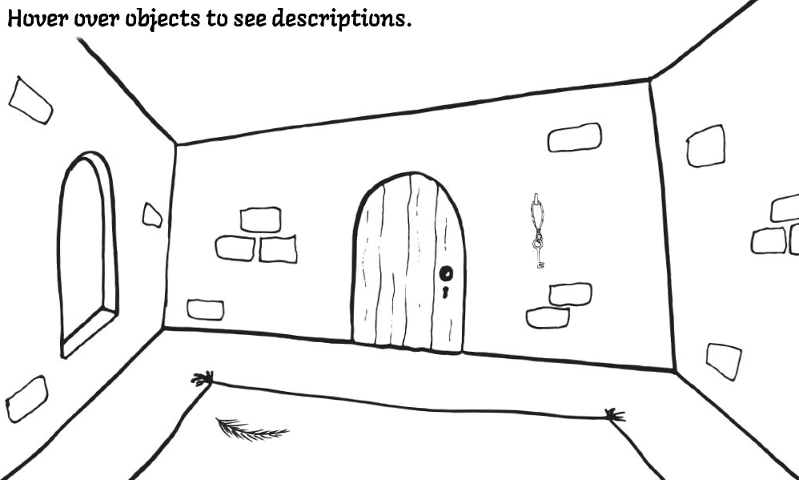
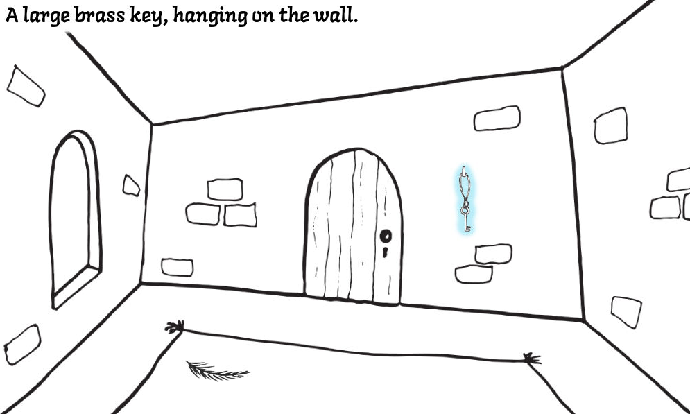

# CPPND: Capstone Project (Option 1)

This is a Capstone Project for the [Udacity C++ Nanodegree Programme](https://www.udacity.com/course/c-plus-plus-nanodegree--nd213). The Capstone Project was a chance to integrate some of the principles I learned throughout the Nanodegree Programme. The project I have built creates the beginnings of a point and click style game.


## Dependencies for Running Locally

If using a Udacity Workspace to run the project, most dependencies are already installed, simply run the following commands to install SDL2_image and SDL2_ttf:
`sudo apt-get install libsdl2-image-dev` and `sudo apt-get install libsdl2-ttf-dev`

If building in your own environment, the following dependencies will be required:
* cmake >= 3.7
  * All OSes: [click here for installation instructions](https://cmake.org/install/)
* make >= 4.1 (Linux, Mac), 3.81 (Windows)
  * Linux: make is installed by default on most Linux distros
  * Mac: [install Xcode command line tools to get make](https://developer.apple.com/xcode/features/)
  * Windows: [Click here for installation instructions](http://gnuwin32.sourceforge.net/packages/make.htm)
* SDL2, SDL2_image, SDL2_ttf >= 2.0
  * All installation instructions can be found [here](https://wiki.libsdl.org/Installation)
  * Note that for Linux, an `apt` or `apt-get` installation is preferred to building from source.
* gcc/g++ >= 5.4
  * Linux: gcc / g++ is installed by default on most Linux distros
  * Mac: same deal as make - [install Xcode command line tools](https://developer.apple.com/xcode/features/)
  * Windows: recommend using [MinGW](http://www.mingw.org/)


## Basic Build Instructions

1. Clone this repo
2. Make a build directory in the top level directory: `mkdir build && cd build`
3. Compile: `cmake .. && make`
4. Run it: `./bin/PointAndClickGame`


## Project Overview

This project is the bare bones of a point and click game. I created it to help me learn how to use SDL2 and reinforce my C++ knowledge. The functionality using SDL2 is based on tutorials from [Will Usher](https://www.willusher.io/sdl2%20tutorials/2013/08/17/lesson-1-hello-world) and [Lazy Foo](http://lazyfoo.net/tutorials/SDL/).


## Expected Output



As you move the mouse over items that can be selected they will become highlighted. 
When you click on an object it will remain highlighted until you click a second object
to use it with. The text will tell you if the match was correct. 



In this example there are only two objects, to demonstrate the functionality: a key and a keyhole. When you click either object and then the other, the result will be correct and the objects will return to their unhighlighted state.


## File Structure
  ```
+-- PointAndClickGame
|   +-- src
|   +-- CMakeLists.txt
+-- resources
+-- CMakeLists.txt
+-- README.md
  ```


## 5 Rubric Points

* The project demonstrates an understanding of C++ functions and control structures.
  * main.cpp line 54
* The project accepts user input and processes the input.
  * main.cpp line 115
* The project uses Object Oriented Programming techniques.
  * item.h line 12
* Class constructors utilize member initialization lists.
  * item.h line 15
* Overloaded functions allow the same function to operate on different parameters.
  * picture.h line 14